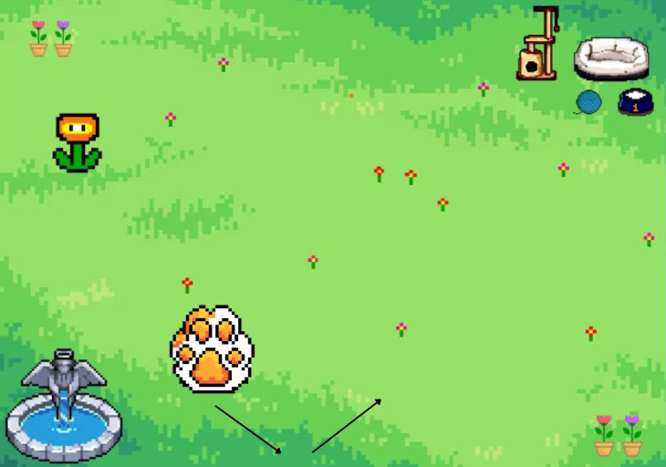

# Relatório de Level Design

## 1. Identificação do Grupo e do Projeto

**Projeto:** Paw Dash   
**Grupo:** BIGODE'S   
**Integrantes:** Cauê Taddeo, Henrique Diniz, Isabela Peçanha, João Agmont, Mariana Souza, Paulo Almeida, Reimar Filho e Thúlio Pinto

## 2. Síntese da Proposta

*O jogo é uma experiência interativa para gatos e seus tutores, projetada para estimular os instintos de caça felinos por meio de fases progressivamente desafiadoras e que apresentam mecânicas inovadoras ao mercado de jogos digitais para felinos. Com gráficos otimizados para a visão dos gatos, sistema de recompensa com base no sucesso do jogador e uma jobabilidade que incentiva a interação tutor-pet, o jogo combina tecnologia e praticidade para promover bem-estar e diversão compartilhada.*

## 3. Lista de Levels

1. [Tutorial: Movimento Circular](#l1)
2. [Movimento Randômico](#l2)
3. [Divisão do Alvo](#l3)
4. [Tutor no Controle do Alvo](#l4)
5. [Obstáculos na Trajetória do Alvo](#l5)

## 4. Rascunhos Desenvolvidos

*Os links abaixo contém, de forma organizada, o diagrama de cenas e as concepts arts do nosso jogo, que ajudam a entender cada level do nosso jogo e o restante da interface. Utilize-os como guia para visualizar de forma clara os detalhes de cada fase.*
- Concept Art: https://www.figma.com/design/cVbJo00x8BpZQIv578cxQV/Figma-basics?node-id=1669-162202&p=f
- Diagrama de Cenas: https://www.figma.com/design/luhoZeSsvZhyLUqD8fNmj2/Figma-basics?node-id=1669-162202&m=dev&t=uKMiVoDUYkJhOkML-1

---

###  Level 1: Movimento Circular
**Responsável:** Isabela e Thulio   
**Situação:** Concluído

#### Prévia:

Prévia do Level 1

Fonte: Material produzido pelos autores (2025)

#### Descrição da Jogabilidade e Experiência do Jogador:
*Nessa fase, a pata fará movimentos circulares simples e lentos, de modo a facilitar a conclusão desse nível. O objetivo dessa fase é introduzir as dinâmicas e as mecânicas básicas do jogo, como o sistema de recompensa e a destruição do alvo, para o tutor e para o gato.*

---

###  Level 2: Movimento Randômico
**Responsável:** Isabela e Thulio   
**Situação:** Em Desenvolvimento

#### Prévia:

Prévia do Level 2

Fonte: Material produzido pelos autores (2025)

#### Descrição da Jogabilidade e Experiência do Jogador:
*Nessa fase, a pata se move de forma mais imprevisível e complexa, não mais em um movimento circular, mas sim cruzando a tela e colidindo com as bordas, de modo a dinamizar a gameplay e por consequência dificultar o jogo.*

---

###  Level 3: Divisão do Alvo
**Responsável:** João e Reimar   
**Situação:** Em Desenvolvimento

#### Prévia:

Prévia do Level 3

Fonte: Material produzido pelos autores (2025)

#### Descrição da Jogabilidade e Experiência do Jogador:
*Nessa fase, uma pata inicial se movimenta até ser acertada pelo jogador, assim que for acertada, a pata irá se dividir em outros dois novos alvos, tornando a dificuldade do nível consideravelmente maior para que os instintos do gato sejam treinados de diferentes formas.*

---

###  Level 4: Tutor no Controle do Alvo
**Responsável:** Mariana e Paulo   
**Situação:** Ideia Pretendida

#### Prévia:

Prévia do Level 4

Fonte: Material produzido pelos autores (2025)

Concept Art do Level 4 (1)

Fonte: Material produzido pelos autores (2025)

Concept Art do Level 4 (2)

Fonte: Material produzido pelos autores (2025)

#### Descrição da Jogabilidade e Experiência do Jogador:
*Nessa fase, a ideia se assemelha à fase 1 e a fase 2. No entanto, o movimento do alvo é ditado pelo tutor, que pode controlar a pata da maneira que preferir a partir do controle que ficará no canto da tela de seu dispositivo móvel. Para essa fase, será necessário utilizar dois aparelhos eletrônicos: um para o gato e o outro para o tutor, conectados entre si, onde a tela do gato será transmitida para o seu tutor. Na tela do tutor, terão dois controladores: um para a direção da pata e outro para a velocidade da movimentação da pata.*

---

###  Level 5: Obstáculos na Trajetória do Alvo
**Responsável:** Cauê e Henrique   
**Situação:** Ideia Pretendida

#### Prévia:

Prévia do Level 5

Fonte: Material produzido pelos autores (2025)

#### Descrição da Jogabilidade e Experiência do Jogador:
*Nessa fase, é introduzido um novo desafio: a pata se movimenta pelo cenário, passando por baixo de obstáculos, como pontes e elementos interativos, tornando mais difícil para o gato acertá-la. Essa mecânica exige mais precisão, paciência e estratégia, pois o jogador (Gato) deve aguardar o momento certo para tocar na pata. A experiência pretendida é aumentar a imersão e a sensação de caça e perseguição, estimulando o instinto felino de observação e reação rápida. Essa fase prepara o Gato para desafios ainda mais dinâmicos, onde a pata poderá mudar de direção, velocidade ou até desaparecer temporariamente, mantendo o engajamento e evolução contínua da jogabilidade.*

---

